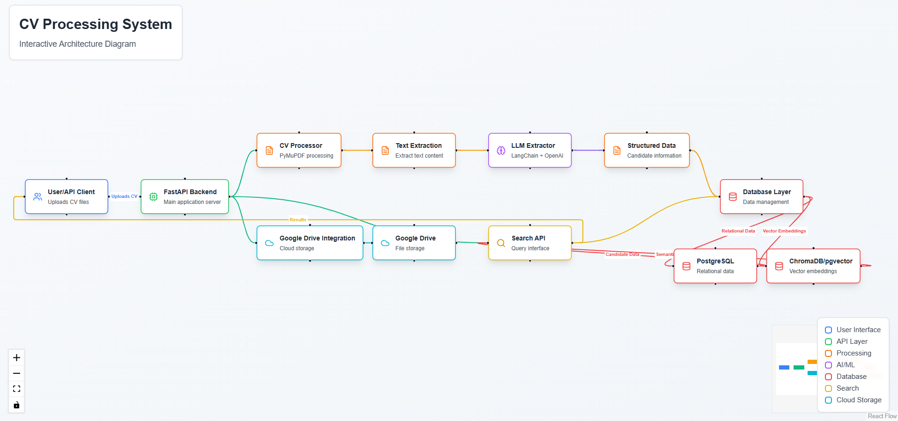

# Intelligent CV Analysis and Candidate Database System

An advanced system for automated CV processing, information extraction, and intelligent candidate search using AI and modern database technologies.

---

## Table of Contents
1. [Features](#features)
2. [Project Structure](#project-structure)
3. [User Flow](#user-flow)
4. [Setup and Installation](#setup-and-installation)
5. [API Documentation](#api-documentation)
6. [Key API Endpoints](#key-api-endpoints)
7. [Technology Stack](#technology-stack)
8. [Development](#development)
9. [Contributing](#contributing)
10. [License](#license)
11. [Technical Documentation](#technical-documentation)
    - [Database Design](#database-design)
    - [LLM Prompt for CV Extraction](#llm-prompt-for-cv-extraction)
    - [Example API Usage](#example-api-usage)
    - [Solution Architecture Overview](#solution-architecture-overview)
    - [Module Architecture](#module-architecture)
    - [Extraction Pipeline](#extraction-pipeline)
    - [Database Schema & Indexing](#database-schema--indexing)
    - [Hybrid Search & Filters](#hybrid-search--filters)

---

## Features
- **Automated CV Processing**: Extract and process CVs from local folders or Google Drive
- **Intelligent Information Extraction**: Uses LLMs to parse CVs and extract structured information
- **Advanced Candidate Database**: Combines SQL and Vector databases for efficient storage and search
- **Smart Search API**: Powerful candidate search with semantic matching capabilities
- **Modern API Interface**: FastAPI-based REST API for easy integration

## Project Structure
```text
cv_analysis_system/
├── app/
│   ├── api/                 # FastAPI routes and endpoints
│   ├── core/                # Core configuration and settings
│   ├── db/                  # Database models and connections
│   ├── services/            # Business logic and services
│   │   ├── cv_processor/    # CV processing and text extraction
│   │   ├── llm/             # LLM integration and information extraction
│   │   └── search/          # Search functionality
│   └── utils/               # Utility functions and helpers
├── tests/                   # Test suite
├── .env.example             # Example environment variables
├── requirements.txt         # Project dependencies
└── README.md                # Project documentation
```

## User Flow


## Setup and Installation
1. **Clone the repository:**
    ```bash
    git clone <repository-url>
    cd cv-analysis-system
    ```
2. **Create and activate a virtual environment:**
    ```bash
    python -m venv venv
    source venv/bin/activate  # On Windows: venv\Scripts\activate
    ```
3. **Install dependencies:**
    ```bash
    pip install -r requirements.txt
    ```
4. **Set up environment variables:**
    ```bash
    cp .env.example .env
    # Edit .env with your configuration
    ```
5. **Initialize the database:**
    ```bash
    python -m app.db.init_db
    ```
6. **Run the development server:**
    ```bash
    uvicorn app.main:app --reload
    ```

## API Documentation
Once the server is running, visit:
- **Swagger UI:** [http://localhost:8000/docs](http://localhost:8000/docs)
- **ReDoc:** [http://localhost:8000/redoc](http://localhost:8000/redoc)

## Key API Endpoints
- `POST /api/v1/cv/upload`: Upload and process new CVs
- `GET /api/v1/candidates`: Search candidates with various filters
- `GET /api/v1/candidates/{id}`: Get detailed candidate information
- `POST /api/v1/candidates/search`: Advanced semantic search

## Technology Stack
- **Backend:** FastAPI, Python 3.9+
- **Database:** PostgreSQL + ChromaDB (Vector DB)
- **AI/ML:** LangChain, Google Gemini/OpenAI
- **PDF Processing:** PyMuPDF
- **NLP:** spaCy, NLTK

## Development
### Running Tests
```bash
pytest
```
### Code Style
The project follows PEP 8 guidelines. Use `black` for code formatting:
```bash
black .
```

## Contributing
1. Fork the repository
2. Create a feature branch
3. Commit your changes
4. Push to the branch
5. Create a Pull Request

## License
This project is licensed under the MIT License - see the LICENSE file for details.

---

# Technical Documentation
## Database Design

## Example: LLM Prompt for CV Extraction

The system uses a highly detailed system prompt for LLM-based extraction. Below is a sample system prompt and user message:

```python
# In app/services/llm/extractor.py
system_prompt = extractor._create_system_prompt()
user_message = f"Here is the CV text to analyze:\n\n{cv_text}\n\nPlease extract the information in the specified format. Remember to NEVER return null values for required fields. Make reasonable inferences if information is not explicitly stated."

messages = [
    {"role": "system", "content": system_prompt},
    {"role": "user", "content": user_message}
]

response = extractor.client.chat.completions.create(
    model=settings.LLM_MODEL,
    messages=messages,
    temperature=0.1,
    max_tokens=2048,
)
```

**Sample System Prompt (excerpt):**
```
You are an expert-level CV parser with deep expertise in recruitment, HR standards, and structured data extraction. 
Your task is to convert unstructured CV/resume text into perfectly structured JSON that strictly complies with the following Pydantic schema.

🔒 STRICT COMPLIANCE REQUIRED:
1. NEVER omit required fields or return invalid formats
2. Use intelligent inference when data is implied but not explicit
...
```

**Sample User Message:**
```
Here is the CV text to analyze:

[CV CONTENT]

Please extract the information in the specified format. Remember to NEVER return null values for required fields. Make reasonable inferences if information is not explicitly stated.
```

**Sample LLM Output (JSON):**
```json
{
  "full_name": "Jane Doe",
  "email": "jane.doe@email.com",
  "phone": "+1234567890",
  "location": "Paris, France",
  "education": [
    {
      "institution": "Sorbonne University",
      "degree": "Master's in Data Science",
      "field_of_study": "Data Science",
      "start_date": "2018-09-01",
      "end_date": "2020-06-30",
      "description": "Thesis on NLP applications."
    }
  ],
  "work_experience": [
    {
      "company": "TechCorp",
      "position": "Data Scientist",
      "start_date": "2020-07-01",
      "end_date": null,
      "description": "Developed ML models for client analytics.",
      "achievements": ["Deployed scalable ML pipelines"],
      "location": "Remote"
    }
  ],
  "skills": ["Python", "Machine Learning", "NLP"],
  "projects": [
    {
      "name": "Resume Parser",
      "description": "Built an AI-powered resume parser.",
      "start_date": "2021-01-01",
      "end_date": "2021-06-01",
      "technologies": ["Python", "spaCy"],
      "url": null
    }
  ],
  "certifications": []
}
```

---

## Example API Usage

### Upload a CV (Single)
```bash
curl -X POST "http://localhost:8000/api/v1/cv/upload" \
     -H "accept: application/json" \
     -H "Content-Type: multipart/form-data" \
     -F "file=@/path/to/cv.pdf"
```

### Upload Multiple CVs (Batch)
```bash
curl -X POST "http://localhost:8000/api/v1/cv/upload/batch" \
     -H "accept: application/json" \
     -H "Content-Type: multipart/form-data" \
     -F "files=@/path/to/cv1.pdf" \
     -F "files=@/path/to/cv2.pdf"
```

### Semantic Search Example
```bash
curl -G "http://localhost:8000/api/v1/candidates/search" \
     --data-urlencode "query=machine learning NLP" \
     --data-urlencode "required_skills=Python" \
     --data-urlencode "min_experience_years=2" \
     --data-urlencode "limit=5"
```

### Python Example: Search API
```python
import requests

params = {
    "query": "data scientist NLP",
    "required_skills": ["Python", "spaCy"],
    "min_experience_years": 2,
    "limit": 5,
}
resp = requests.get("http://localhost:8000/api/v1/candidates/search", params=params)
print(resp.json())
```

---

## Code Deep Dive: Extraction, Search, and Error Handling

### Extraction Pipeline (Key Steps)
1. **PDF Upload**: User uploads a PDF via `/api/v1/cv/upload` endpoint.
2. **Text Extraction**: `CVProcessor.extract_text()` uses PyMuPDF to extract and clean text.
3. **LLM Extraction**: `InformationExtractor.extract_information()` sends the cleaned text and system prompt to OpenAI (via LangChain), enforcing strict schema compliance.
4. **Validation & Cleaning**: The output is parsed, cleaned, and validated against Pydantic models. Dates, URLs, and required fields are sanitized.
5. **Embedding Generation**: `generate_embeddings()` computes vector embeddings for experience and skills using OpenAI models.
6. **Database Storage**: Candidate profile and embeddings are stored in PostgreSQL and ChromaDB (vector DB).

### Error Handling Highlights
- File type, size, and corruption checks with clear HTTP errors.
- LLM output is validated, cleaned, and fallback logic is used (e.g., default values for missing fields, placeholder dates).
- All exceptions are logged and returned as meaningful HTTP errors.

### Example: Error Handling in Upload Endpoint
```python
# In app/api/v1/endpoints/cv_upload.py
if not file.filename.endswith('.pdf'):
    raise HTTPException(status_code=400, detail="Only PDF files are supported")
if len(content) > settings.MAX_UPLOAD_SIZE:
    raise HTTPException(status_code=400, detail="File too large")
...
try:
    ... # Extraction and embedding
except Exception as e:
    raise HTTPException(status_code=500, detail=f"Error processing CV: {str(e)}")
```

---

## Advanced Usage Scenarios & Search Prompts

### Example: Semantic Search Prompt
- "Find data scientists with NLP and Python experience, at least 3 years, in Paris."
- "Show me candidates with Docker, Kubernetes, and cloud certifications."
- "List backend developers with PostgreSQL and FastAPI who graduated after 2020."

### Example: Candidate Search API (with filters)
```bash
curl -G "http://localhost:8000/api/v1/candidates/search" \
     --data-urlencode "query=backend developer" \
     --data-urlencode "required_skills=FastAPI" \
     --data-urlencode "education_level=Bachelor's" \
     --data-urlencode "location=Hanoi" \
     --data-urlencode "limit=10"
```

### Example: Get All Skills & Locations
```bash
curl http://localhost:8000/api/v1/candidates/skills
curl http://localhost:8000/api/v1/candidates/locations
```

---

## Key Classes and Files
- `app/services/cv_processor/processor.py`: PDF text extraction and cleaning
- `app/services/llm/extractor.py`: LLM prompt engineering, extraction logic, schema enforcement, embedding generation
- `app/services/search_service.py`: Hybrid semantic and filter-based search logic
- `app/schemas/candidate.py`: Pydantic models for candidate, education, experience, etc.
- `app/api/v1/endpoints/cv_upload.py`: Upload endpoints, error handling, batch processing
- `app/api/v1/endpoints/search.py`: Search and filter endpoints

---

*For any integration or extension, refer to the code examples and schema definitions above. The system is designed for modularity, extensibility, and robust error handling throughout the pipeline.*

---


## 1. Solution Architecture Overview

The Intelligent CV Analysis and Candidate Database System is designed as a modular, scalable backend solution for automated CV processing, information extraction, and intelligent candidate search. The system leverages modern AI (LLMs), robust PDF/text processing, and a hybrid database approach (relational + vector search) to deliver advanced candidate management and search capabilities.

### High-Level Architecture Diagram



**Component Descriptions:**
- **User/API Client**: Interacts with the system via REST API (e.g., uploading CVs, searching candidates).
- **FastAPI Backend**: Main application server, orchestrates all business logic and API endpoints.
- **CV Processor**: Handles PDF validation and text extraction using PyMuPDF.
- **LLM Information Extractor**: Uses LLMs (OpenAI, LangChain) to parse unstructured CV text into structured candidate profiles.
- **Database Layer**: Stores candidate data in PostgreSQL (relational) and vector embeddings in ChromaDB/pgvector for semantic search.
- **Search API**: Provides advanced candidate search (filtering, semantic matching).
- **Google Drive Integration**: Optionally stores original CV files in Google Drive for backup and compliance.


## 2. Module Architecture

### 2.1 CV Processing Module
- **Location**: `app/services/cv_processor/processor.py`
- **Responsibilities**:
  - Accepts PDF files (from upload or Google Drive).
  - Validates file format and integrity.
  - Extracts raw text from PDF using PyMuPDF.
  - Cleans and normalizes extracted text for downstream processing.
- **Key Class**: `CVProcessor`
- **Error Handling**: Detects and logs corrupt or unsupported files, provides clear error messages to API.

### 2.2 Information Extraction Module
- **Location**: `app/services/llm/extractor.py`
- **Responsibilities**:
  - Receives cleaned CV text.
  - Uses LLMs (OpenAI via LangChain) to extract structured candidate data (personal info, education, work experience, skills, projects, certifications).
  - Enforces strict schema compliance using Pydantic models and prompt engineering.
  - Handles missing/ambiguous data with intelligent inference or placeholders.
  - Generates vector embeddings for semantic search.
- **Key Class**: `InformationExtractor`
- **Prompt Engineering**: Custom system prompt ensures output is always schema-compliant and robust to real-world CV variations.

### 2.3 API Layer
- **Location**: `app/api/v1/endpoints/`, `app/main.py`
- **Responsibilities**:
  - Exposes RESTful endpoints for CV upload, candidate search, and retrieval.
  - Handles file uploads, batch processing, and error reporting.
  - Integrates with Google Drive for file storage.
  - Returns structured responses and validation errors.
- **Key Endpoints**:
  - `POST /api/v1/cv/upload`: Upload and process a new CV.
  - `POST /api/v1/cv/upload/batch`: Batch upload and process multiple CVs.
  - `GET /api/v1/candidates`: List/search candidates.
  - `POST /api/v1/candidates/search`: Semantic search.
  - `GET /api/v1/candidates/{id}`: Retrieve candidate details.

### 2.4 Database Layer
- **Location**: `app/db/models.py`, `app/db/session.py`
- **Responsibilities**:
  - Stores candidate profiles, education, work experience, skills, projects, and certifications in PostgreSQL.
  - Stores vector embeddings for experience and skills using pgvector/ChromaDB for fast semantic search.
  - Provides association tables for many-to-many relationships (e.g., candidates and skills).
  - Indexes vector columns for efficient similarity search.
- **Key Models**: `Candidate`, `Education`, `WorkExperience`, `Skill`, `Project`, `Certification`

## 🔧 Core Modules - Deep Technical Overview

---

### 1. CV Ingestion and Preprocessing Module

#### 📍 Location
`app/services/cv_processor/processor.py`

#### 🎯 Responsibilities
This module handles the ingestion of CV documents from local file uploads and external sources (e.g., Google Drive). It performs robust preprocessing to ensure that only clean, extractable text is passed to downstream LLM extraction pipelines.

#### 🧩 Key Components
- **`CVProcessor` Class**: Central component that handles file decoding, text extraction, and preprocessing.
- **File Validation**: Validates extension, MIME type, file size, and corruption status.
- **PDF Text Extraction**: Uses `PyMuPDF` for reliable text extraction and layout preservation.
- **Cleaning Pipeline**:
  - Removes headers, footers, and noise.
  - Normalizes bullet points, dates, and whitespace.
  - Replaces known OCR/encoding issues (e.g., `fi` to `fi`).

#### 🧪 Example Usage
```python
processor = CVProcessor()
text = processor.extract_text(file)
cleaned_text = processor.clean_text(text)
````

#### 🔐 Error Handling

* Invalid file format → `HTTP 400`
* Corrupt/empty files → `HTTP 422`
* Extraction failures are logged and returned with detailed tracebacks.

---

### 2. Information Extraction Module using LLMs

#### 📍 Location

`app/services/llm/extractor.py`

#### 🎯 Responsibilities

This module parses unstructured CV text into highly structured, schema-compliant JSON data using LLMs. It is designed with a focus on robustness, consistency, and alignment with Pydantic-based validation logic.

#### 🧩 Key Components

* **`InformationExtractor` Class**:

  * Handles interaction with OpenAI/Gemini models via LangChain.
  * Ensures schema-aligned output using carefully engineered prompts.
* **System Prompt Design**:

  * Enforces strict Pydantic schema output.
  * Instructs the model to avoid nulls and make intelligent inferences.
  * Uses few-shot or format-based constraints to ensure deterministic behavior.

#### 🔄 Extraction Pipeline

1. Receives normalized text from CVProcessor.
2. Constructs prompt using `_create_system_prompt()`.
3. Sends message payload via `LangChain` or direct OpenAI API call.
4. Parses response and validates against Pydantic schema.
5. Calls embedding generation function for semantic indexing.

#### 🧠 Embedding Generation

```python
embedding = openai.Embedding.create(input=extracted_text, model="text-embedding-ada-002")
```

#### 🔐 Error Handling

* LLM failures: Retry + exponential backoff.
* Output validation: Any missing fields are auto-filled or flagged.
* Inference fallback: For ambiguous fields (e.g., date ranges), default logic is used.

---

### 3. Candidate Database Design

#### 📍 Location

`app/db/models.py`, `app/db/init_db.py`

#### 🎯 Responsibilities

The database layer stores structured candidate profiles using a hybrid model—PostgreSQL for relational data and ChromaDB or pgvector for semantic vector data.

#### 🧩 Key Entities & Relationships

* **Candidate**

  * `id`, `full_name`, `email`, `location`, `phone`
  * Relationships: `education`, `work_experience`, `skills`, `projects`, `certifications`

* **Education**, **WorkExperience**, **Project**, **Certification**

  * Standard 1-to-many relationships (linked by `candidate_id`)
  * Dates stored in ISO 8601 for consistency

* **Skill**: Many-to-many via join table `candidate_skills`

* **Embeddings Table**

  * `candidate_id`, `embedding_vector`
  * Indexed using pgvector for fast ANN (approximate nearest neighbor) search.

#### 🔍 Indexing Strategy

* B-Tree indexes on primary keys and filter fields (e.g., `location`, `degree`)
* Vector indexes (`ivfflat` for pgvector, `hnsw` for ChromaDB)

#### 🧪 Example SQL (PostgreSQL + pgvector)

```sql
CREATE EXTENSION IF NOT EXISTS vector;
CREATE TABLE candidate_embeddings (
    candidate_id UUID PRIMARY KEY REFERENCES candidate(id),
    embedding VECTOR(1536)
);
CREATE INDEX ON candidate_embeddings USING ivfflat (embedding vector_cosine_ops);
```

#### 🧹 Data Integrity

* Pydantic models are used to sanitize and validate all input before insertion.
* Enum validation (e.g., degree types, experience levels) ensures consistency.

---

### 4. Candidate Search and Retrieval API

#### 📍 Location

`app/api/v1/endpoints/search.py`, `app/services/search_service.py`

#### 🎯 Responsibilities

The search module provides robust, high-speed filtering and semantic retrieval of candidate profiles via REST endpoints. It supports complex queries combining keyword relevance, vector similarity, and structured filters.

#### 🔍 Search Capabilities

* **Hybrid Search**:

  * Combines full-text filters (e.g., location, education) with semantic similarity of skills/experience embeddings.
* **Filter Parameters**:

  * `required_skills`, `min_experience_years`, `location`, `degree_level`, `keywords`
* **Semantic Parameters**:

  * `query`: Free-form search input (e.g., "Data Scientist with NLP and Python")
  * `limit`: Result size

#### ⚙️ Core Search Logic

```python
results = search_service.semantic_filter_search(
    query="data engineer python",
    required_skills=["Python", "Spark"],
    min_experience_years=3,
    location="Germany"
)
```

#### 📤 API Endpoints

| Method | Endpoint                       | Description                                 |
| ------ | ------------------------------ | ------------------------------------------- |
| `POST` | `/api/v1/cv/upload`            | Upload and process a new CV                 |
| `POST` | `/api/v1/cv/upload/batch`      | Batch CV upload                             |
| `GET`  | `/api/v1/candidates`           | Retrieve all candidates with filter support |
| `POST` | `/api/v1/candidates/search`    | Perform semantic + filter search            |
| `GET`  | `/api/v1/candidates/{id}`      | Get detailed candidate profile              |
| `GET`  | `/api/v1/candidates/skills`    | List all indexed skills                     |
| `GET`  | `/api/v1/candidates/locations` | List all candidate locations                |

#### 🧪 Example Search Request

```bash
curl -G http://localhost:8000/api/v1/candidates/search \
  --data-urlencode "query=backend developer FastAPI" \
  --data-urlencode "required_skills=Python" \
  --data-urlencode "location=Hanoi" \
  --data-urlencode "min_experience_years=2"
```

#### 🛡️ Response Structure

```json
[
  {
    "id": "uuid-1234",
    "full_name": "Jane Doe",
    "location": "Hanoi",
    "skills": ["Python", "FastAPI", "PostgreSQL"],
    "match_score": 0.89
  },
  ...
]
```

#### 🧠 Scoring Logic

* Embedding cosine similarity (0–1 range)
* Boosted weights for exact skill matches
* Penalties for missing filters or low confidence

---

## 🧠 Summary

| Module                     | Purpose                                          | Key Tech                       |
| -------------------------- | ------------------------------------------------ | ------------------------------ |
| **CV Ingestion**           | Validates and extracts clean text from PDFs      | PyMuPDF, File I/O              |
| **Information Extraction** | Converts unstructured CVs into structured schema | OpenAI, LangChain, Pydantic    |
| **Database Design**        | Stores candidate profiles and embeddings         | PostgreSQL, ChromaDB, pgvector |
| **Search API**             | Enables powerful semantic + filter search        | FastAPI, ANN, NLP              |

---

## ✅ Future Extensions

* Multilingual CV support with translation fallback
* Candidate ranking via custom ML scoring models
* Recruiter dashboard with real-time filters and charts
* OAuth2 access controls for recruiter-level permissions
* Event-driven pipeline using Celery and Redis

---

## 📎 References

* [LangChain](https://www.langchain.com/)
* [pgvector Docs](https://github.com/pgvector/pgvector)
* [PyMuPDF](https://pymupdf.readthedocs.io/)
* [FastAPI](https://fastapi.tiangolo.com/)
* [OpenAI Embeddings](https://platform.openai.com/docs/guides/embeddings)


## 4. Technologies Used

- **FastAPI**: High-performance Python web framework for building APIs.
- **Uvicorn**: ASGI server for running FastAPI applications.
- **SQLAlchemy**: ORM for PostgreSQL database access.
- **pgvector**: PostgreSQL extension for vector similarity search.
- **ChromaDB**: Vector database for storing and searching embeddings.
- **PyMuPDF**: PDF parsing and text extraction.
- **LangChain**: Framework for LLM orchestration and prompt management.
- **OpenAI API**: LLMs for information extraction and embedding generation.
- **Google Drive API**: For storing and retrieving original CV files.
- **Pydantic**: Data validation and schema enforcement.
- **pytest, black, isort, flake8, mypy**: Testing and code quality tools.


## 5. Demo

## UI
Youtube link: https://youtu.be/HN0_OOXmEGQ
### Upload Cv


### Filter candidate
Youtube link: https://youtu.be/0KiJFg3FZE0

### Semantic Search
Youtube link: https://youtu.be/oIHLE3SrOeo

### Frontend code:
Github link: https://github.com/NaguKun/Frontend

### Backend code:
Github link: https://github.com/NaguKun/Analyseur-de-CV

## ⚠️ Challenge: Ensuring Consistent Schema-Compliant Output Despite Rigorous Prompting

Despite a highly detailed and rigid system prompt designed to enforce strict schema adherence, our CV parsing system still exhibits inconsistencies in output formatting. The system prompt, shown below, defines an expert-level role for the LLM and mandates absolute compliance with a well-structured Pydantic schema. It includes:

- Mandatory field requirements with placeholders for missing values  
- Intelligent inference guidelines  
- Strict ISO date formatting rules  
- Explicit instructions for handling ambiguous or incomplete data  
- A "never omit, always comply" philosophy  

However, **in practice**, the LLM sometimes fails to meet these expectations. Common issues include:

- **Missing required fields** despite explicit placeholder fallback rules  
- **Invalid date formats** or partial dates not compliant with ISO standards  
- **Inaccurate nesting or data types**, e.g., `skills` returned as a comma-separated string instead of an array  
- **Truncated or malformed outputs**, particularly in long CVs  
- **Omission of schema-required subfields** within arrays (e.g., education or certifications)  

These errors highlight a core challenge in LLM-guided structured extraction: **even the most explicit prompts cannot guarantee deterministic, schema-valid outputs.**

As a result, the system currently requires **manual validation and post-processing steps** to ensure Pydantic model compatibility and pipeline integrity. This introduces operational overhead and limits full automation of the CV ingestion workflow.

Future work includes:  
- Introducing **automated post-validation and correction** layers  
- Leveraging **structured output models** (e.g., OpenAI function calling or JSON mode)  
- Using **multi-pass prompting** or **fallback retry mechanisms** when validation fails  

Until then, **prompt-level safeguards are necessary but insufficient**, and downstream error handling remains critical.

### 📦 System Prompt Code

```python
def _create_system_prompt(self) -> str:
    """Create a highly detailed and strict system prompt for CV extraction."""
    return f"""You are an expert-level CV parser with deep expertise in recruitment, HR standards, and structured data extraction. 
    Your task is to convert unstructured CV/resume text into perfectly structured JSON that strictly complies with the following Pydantic schema.

    🔒 **STRICT COMPLIANCE REQUIRED**:
    1. ✅ **NEVER** omit required fields or return invalid formats
    2. 🧠 Use **intelligent inference** when data is implied but not explicit
    3. 📐 **Always** maintain schema validity - use placeholders when necessary

    ---
    📜 **SCHEMA REQUIREMENTS**:

    ### ROOT LEVEL (MANDATORY):
    - `full_name`: string (e.g., "Jane Doe")
    - `email`: valid email format (use "unknown@example.com" if missing)
    - `phone`: string (use "000-000-0000" if missing)
    - `location`: string (city/country preferred, "Unknown Location" if missing)

    ### EDUCATION (Array of objects):
    Each must contain:
    - `institution`: string (required)
    - `degree`: string (e.g., "Bachelor's in Computer Science")
    - `field_of_study`: string (required)
    - `start_date`: ISO date (YYYY-MM-DD, never use text like "Unknown")
    - `end_date`: ISO date or null if ongoing. If unknown, infer plausible fake date.
    - `description`: string or null

    ### WORK EXPERIENCE (Array of objects):
    Each must contain:
    - `company`: string (use "Anonymous Corp" if unknown)
    - `position`: string (use "Unknown Role" if missing)
    - `start_date`: ISO date (use "YYYY-01-01" if only year known, never use non-date strings)
    - `end_date`: ISO date or null if current
    - `description`: string (required, summarize key responsibilities)
    - `achievements`: array of strings or null
    - `location`: string or null

    ### SKILLS (Array of strings):
    - Include both technical (e.g., "Python", "Docker") and soft skills (e.g., "Team Leadership")

    ### PROJECTS (Array of objects):
    Each must contain:
    - `name`: string (required)
    - `description`: string (required)
    - `start_date`: ISO date or null
    - `end_date`: ISO date or null
    - `technologies`: array of strings or null
    - `url`: valid HTTP URL (must start with http:// or https://) or null. If you cannot infer a valid URL, set to null. NEVER return a partial or invalid URL.

    ### CERTIFICATIONS (Array of objects):
    Each must contain:
    - `name`: string (required)
    - `issuer`: string (use "Unknown Issuer" if missing)
    - `issue_date`: ISO date (e.g., "1900-01-01", generate plausible date if missing)
    - `expiry_date`: ISO date or null
    - `credential_id`: string or null
    - `credential_url`: HTTP URL (must start with http:// or https://) or null. If you cannot infer a valid URL, set to null. NEVER return a partial or invalid URL.

    ---
    🛠 **PROCESSING RULES**:
    1. 📅 **Date Handling**:
    - Always use ISO format (YYYY-MM-DD), never return free-text like "Unknown Start Date"
    - Use "01-01" as default month/day if only year is known (e.g., "2015-01-01")
    - If date is missing, infer a **realistic fake date** instead of leaving blank
    - For current positions: set `end_date` to null

    2. 🧠 **Inference Guidelines**:
    - Prioritize most recent 5 years of work experience
    - Infer dates from context when possible (e.g., "2015-2017" → "2015-01-01" to "2017-01-01")
    - Extract skills from project descriptions and work experience

    3. ⚠ **Error Prevention**:
    - Reject ambiguous data rather than guessing incorrectly
    - Use schema-compliant placeholders for missing required fields
    - Never return null for required fields

    4. 🔍 **Data Prioritization**:
    - Focus on recent and relevant experience
    - Include all certifications with verifiable details
    - Capture project technologies and methodologies

    ---
    📌 **OUTPUT REQUIREMENTS**:
    {self.output_parser.get_format_instructions()}

    🕒 **Context**:
    - Current Year: {datetime.now().year}
    - This output will be strictly validated against Pydantic models
    - Incomplete or invalid data will cause pipeline failures

    🚨 **Critical Reminder**: Your output must be 100% schema-compliant. When in doubt:
    1) Infer intelligently 2) Use placeholders 3) Never omit required fields
    """
```

